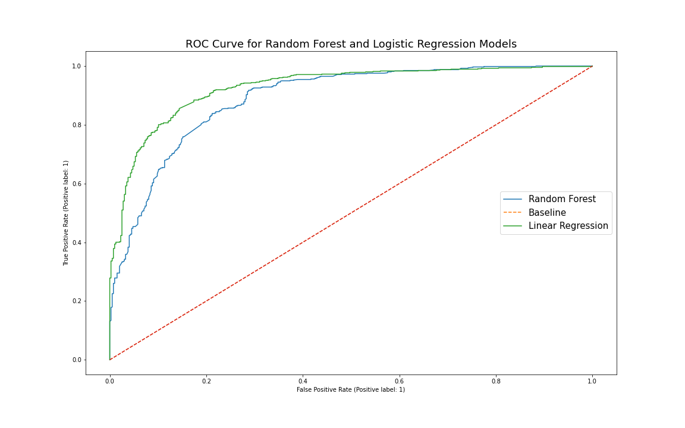

# Subreddit Classification Project

<a href="url"></a>
<a href="url"></a>

## Contents
* [Overview](#Overview)
* [Repository Structure](#structure)
* [Execuitive Summary](#summary)
* [Conclusions and Recommendations](#conclusion)
* [Data Dictionary](#dictionary)

## Overview
Online text has became a very important data source to analyze and provide business insights.  In this project, I am going to retrieve data from
[Reddit](https://www.Reddit.com/) to predict the subreddit topics for a **CryptoCurrencies Trading Software Companies** to put advertisement in target thread. Specifically, I am pulling data from subreddit `r/StockMarket` and `r/CryptoCurrency` threads. Additionally, the analysis will be based on the text from each subreddit's **titles**. 
 
I will be utilizing Natural Language Processing(NLP) to determine weather the author would like to trade typical stocks or cryptocurrencies. The goal for this project is to build and test two classification models that can predict whether the author is more likely to trade in Stock Market or CryptoCurrency Market. I will advise my audience on online advertisement posting strategies.

<a id='structure'></a>
## Repository Structure
```
project
│   README.md
│   Presentation.pdf
└───data
│   │   reddit_data.csv
│   │   reddit_data_clean.csv
│   
└───workbooks
│   │   Data_collecting.ipynb
│   │   Cleaning_EDA.ipynb
│   │   Modeling_conclusion.ipynb
│   
└───image    
   
```
<a id='summary'></a>
## Executive Summary

This project can be separated to 3 different parts. 

In the first part of the project, I will be focusing on collecting data from the Reddit API. The data will be collected from both subreddit groups equally for 3000 rows. The subreddits titles will be collected separably and combined to one single file as `reddit_data.csv`.

In the second part, I will be focusing on data cleaning, implementing `NLP` techniques to translate the text data for interpretations. Also i will visualize the dataset to find and understand the data more before modeling. At the end of this step, the data will be resaved as`reddit_data_clean.csv`.

In the last part, I will start modeling by setting a `pipeline` to `GridSearch` hyperparameters. In addition, I will be using `CountVectorizer` as the text processing techinique for out model. The models will be tested and evaluated are the **Random Forest Classifier** and **Logistic Regression**. 

<a id='conclusion'></a>
## Conclusions and Recommendations

_In this project we have built two models, Random Forest and Logistic Regression with CountVecorizer. Overall, both model performed better than our baseline accuracy of 62.4%._

</a><a href="url"></a>

_We can observe both of the models shows varies degrees of **overfittings**. Based on the basic metric of accuracy, **Logistic Regression with CountVectorizer perform better in this project.**_


|  | Random Forest | Logistic Regression |
|---|---|---|
| Accuracy Score | 0.840 | 0.850 |
| Sensitivity Score | 0.920 | 0.945 |
| Precision Score | 0.839 | 0.835 |
| Specificity | 0.707 | 0.690 |

    
_As recommending the Logistic Regression model to a CryptoCurrency trading software company to post software advertisement, it is also important to evaluate some other metrics like Sensitivity. **Sensitivity scores** explains among those CryptoCurrency subreddit, how many did the model predict correctly. For Random Forest Model, the sensitivity score is 92.0%. On the other hand, the Logistic Regression has a 94.5% sensitivity scores. Logistic Regression model performed much better than the Random Forest Model. Specifically, as the software company is targeting potential consumers, high sensitivity rate will allow the company target more direct consumers correctly for its Crypto Currency software. In addition to Sensitivity score, I also observed that Logistic Regression model has a lower specificity score. Specificity score shows among those StockMarket subreddit, how many did our model predict correctly. As we are focusing more on the correct prediction on CryptoCurrency, the lower sore can be ignored in this case._ 


_For future improvement to the model, the following steps can be considered:_ 
- _In the EDA part, we have found some words can be lemmatized such as Stock vs Stocks. Therefore, more deep cleaning to the original data can be done before modeling._ 
- _As`StockMarket` and `CryptoCurrency` are very closed topics, there are lots of overlapping words that appears in both subreddit. To better fit our model, we can consider removing these words to reduce some noise in our model._
- _Additionally, we might need to start considering emojis in our model. There are some certain emojis may help to differentiate posts. Based on the source, some emoji patterns are being used for Cryptocurrency for different subject. ([Source](https://www.blockchaincenter.net/crypto-emoji-cheat-sheet/))_
<a id='dictionary'></a>
## Data Dictionary
This data Dictionary explains the final data we will use for modeling.

|Columns|Type|Description|
|---|---|---|
|**title**|*string*|Original title collected from Reddit.| 
|**subreddit**|*string*|A subreddit categories|
|**clean_title**|*string*|a new and cleaned text data from `title` column|
|**cat_subreddit**|*int*|A numerical Value for the binary subreddit categories.|
|**word_count**|*float*|Total numnber of words in the `clean_title` column.|
|**character_count**|*float*|Total numnber of characters in the `clean_title` column.|
